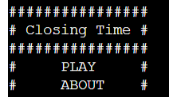
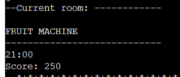
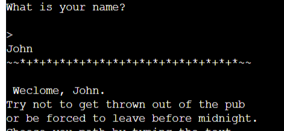
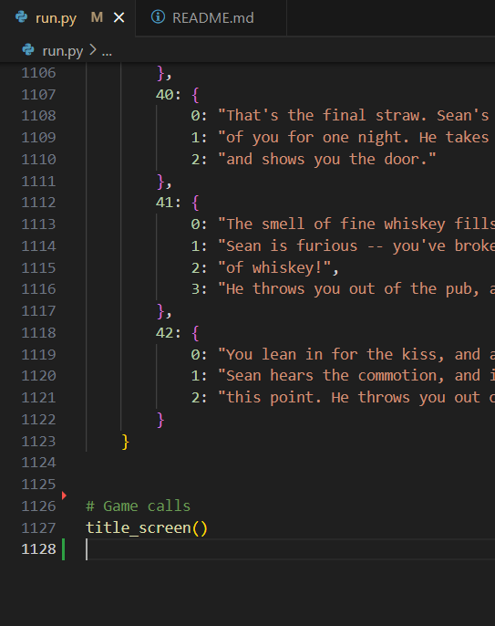

# Closing Time : A Pub RPG

## Description

"Closing Time" is a basic text-based RPG about spending the night in a pub. You must avoid social errors, boring conversation, and aggressive patrons to survive as long into the night as you can. 

The project was inspired by the cyclicle nature of rural life, how the patrons of the typical Irish "local" have their allocated seats, usual drinks, and rarely deviate from their routines. There's a comfort in knowing who everyone is. My game aims to capture the feel of small town life in a quirky and funny way.

I chose an old fashioned RPG because I am interested in old tech. I grew up in the era of game guides being written in ASCII art and printed onto sheets of paper. I have a deep fondness for all things early internet culture, and I wanted to experiment with a branching decision tree type RPG.

The goal of the project is to entertain the player, as they navigate through a night in a small local pub.

## Project Features

Closing Time is simple, but has a few features:
- An in game clock that prints the time as the player makes decisions throughout the night.
- A tile that indicates the room the player is in.
- A function that take's the player's name
- A score counter that keeps tabs on the player's score
- A branching decision tree that brings the player through a narrative
- A narrative that features consequences for your actions
- Answers are case insenstive

I knew I definitely didn't want to have fifty chained if/else statements, so I endeavoured to build a "state machine" that would handle nearly all the narrative and player answers. This gave me problems at the Game Over part of the game, but it allows me in theory to add as many questions and scenarios as I can dream up.

## Installation Instructions

To play the game, head to this URL: [https://portfolio-project-carla-lennon-3003e71640e8.herokuapp.com/]

The game should deploy on opening this page.
In the future, I would like to export the file as a standalone application to share with friends.

## Usage Guide

To navigate the game, you must enter the text in [Square Brackets] to answer each question.

There is a character guide in the "About" section of the menu. 

To restart the game, click the "Run Program" button at the top of the web page.

## Credits

I did relatively little research for this game, compared to my last project. Python logic came together easily after building the first function from the linked tutorial below. 

Once I understood that the order in which functions are called is important in Python, the coin dropped for me in creating the game loop.

- [Baober Video Containing the Player Function](https://www.youtube.com/watch?v=xHPmXArK6Tg&list=PL1-slM0ZOosXf2oQYZpTRAoeuo0TPiGpm&index=2&ab_channel=Baober)
- [W3 Schools: Nested Dictionaries](https://www.w3schools.com/python/python_dictionaries_nested.asp)
- [Code to Clear The Screen (Unused)](https://www.codingninjas.com/studio/library/how-to-clear-a-screen-in-python)
- [Iterating Through A Python Dictionary](https://blog.enterprisedna.co/python-iterate-dictionary/#:~:text=To%20access%20both%20dictionary%20keys,for%20each%20key%2Dvalue%20pair.&text=This%20script%20will%20print%20both,values%20of%20a%20Python%20dictionary.)
- [More Iterating Through Python Dictionarys](https://realpython.com/iterate-through-dictionary-python/)
- [Python Compiler I Used for Testing](https://www.programiz.com/python-programming/online-compiler/)
- [General Python reading](https://www.pygame.org/news)

## Testing

I tested this game as I build it. This was both to check that the game worked, and that as I was adding dictionaries they were properly formatted.

I used the Programiz compiler to test my game as I went. This allowed me to have the game open on one screen and VS Code open in the other.

Despite my testing, there are many errors still in this game.

My code goes through the VSCode Python linter with no issues

## Known Issues

- There are only 3 choices in the first message, when there were originally intended to be 5.
- If the player takes certain routes, the clock will run out of numbers to print, and print "TimeError" instead.
- The player only has 2 chances to get the spelling of their answer correct, or else the game will break. I tried to solve this with a while loop, but this printed hundred of "Please enter your answer"s to the terminal. 
- The room printer will break on several scenarios, due to the room not being entered into the dictionary.
- The game over text will not print to the terminal upon a good OR bad ending. I think this is because the game loop is being called, and functions are trying to reference empty dictionary entries.
- The score function always adds a positive, even if the player loses.

## Future Improvements

- Add the last two branchs into the game
- Add more times to the clock OR limit the length of certain players paths to be less than the time limit
- Implement a system wherein the player can type their answer incorrectly as many times as they like without breaking the game
- Fix the game over print
- Add negative scoring to the game
- Fix all instances of the room printer
- Add an option to play again upon game completion

## Final Thoughts

I enjoyed learning Python. I regret not having time to fully implement my vision, due to overtime at work this month. I may continue with this project.

Python is integral to my career path as an animator. I contacted several technical animators, animation software developers and pipeline specialists over the last month. They all said that Python was essential, as a lot of automation in animation is opening folders, putting all the images into video format, and moving those files into a cloud based production software. 