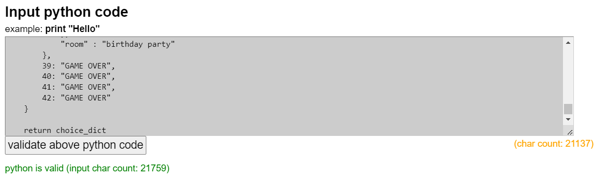

# Closing Time : A Pub RPG

## Description

"Closing Time" is a basic text-based RPG about spending the night in a pub. You must avoid social errors, boring conversation, and aggressive patrons to survive as long into the night as you can. 

The project was inspired by the cyclicle nature of rural life, how the patrons of the typical Irish "local" have their allocated seats, usual drinks, and rarely deviate from their routines. There's a comfort in knowing who everyone is. My game aims to capture the feel of small town life in a quirky and funny way.

I chose an old fashioned RPG because I am interested in old tech. I grew up in the era of game guides being written in ASCII art and printed onto sheets of paper. I have a deep fondness for all things early internet culture, and I wanted to experiment with a branching decision tree type RPG.

The goal of the project is to entertain the player, as they navigate through a night in a small local pub.

## Project Features

Closing Time is simple, but has a few features:
- An in game clock that prints the time as the player makes decisions throughout the night.
- A tile that indicates the room the player is in.
- A function that take's the player's name
- A score counter that keeps tabs on the player's score
- A branching decision tree that brings the player through a narrative
- A narrative that features consequences for your actions
- Answers are case insenstive

I knew I definitely didn't want to have fifty chained if/else statements, so I endeavoured to build a "state machine" that would handle nearly all the narrative and player answers. This gave me problems at the Game Over part of the game, but it allows me in theory to add as many questions and scenarios as I can dream up.

## Installation Instructions

To play the game, head to this URL: [https://portfolio-project-carla-lennon-3003e71640e8.herokuapp.com/]

The game should deploy on opening this page.
In the future, I would like to export the file as a standalone application to share with friends.

## Usage Guide

To navigate the game, you must enter the text in [Square Brackets] to answer each question.

There is a character guide in the "About" section of the menu. 

To restart the game, click the "Run Program" button at the top of the web page.

## Credits

I did relatively little research for this game, compared to my last project. Python logic came together easily after building the first function from the linked tutorial below. 

Once I understood that the order in which functions are called is important in Python, the coin dropped for me in creating the game loop.

- [Baober Video Containing the Player Function](https://www.youtube.com/watch?v=xHPmXArK6Tg&list=PL1-slM0ZOosXf2oQYZpTRAoeuo0TPiGpm&index=2&ab_channel=Baober)
- [W3 Schools: Nested Dictionaries](https://www.w3schools.com/python/python_dictionaries_nested.asp)
- [Code to Clear The Screen (Unused)](https://www.codingninjas.com/studio/library/how-to-clear-a-screen-in-python)
- [Iterating Through A Python Dictionary](https://blog.enterprisedna.co/python-iterate-dictionary/#:~:text=To%20access%20both%20dictionary%20keys,for%20each%20key%2Dvalue%20pair.&text=This%20script%20will%20print%20both,values%20of%20a%20Python%20dictionary.)
- [More Iterating Through Python Dictionarys](https://realpython.com/iterate-through-dictionary-python/)
- [Python Compiler I Used for Testing](https://www.programiz.com/python-programming/online-compiler/)
- [General Python reading](https://www.pygame.org/news)

## Testing

I tested this game as I build it. This was both to check that the game worked, and that as I was adding dictionaries they were properly formatted.

I used the Programiz compiler to test my game as I went. This allowed me to have the game open on one screen and VS Code open in the other.

Despite my testing, there are many errors still in this game.

My code goes through the VSCode Python linter with no issues

## Failing Criteria

Here's the criteria where the project failed, and what I did to fix them.

1. The project does not handle incorrect inputs correctly
   

    
2.1 Fail in Assessment

        
    

       

    
3.2 Fail in Assessment

        
    

        
2.1 and 3.1 Fail in Assessment

        
    

    
    When opening the file, I noticed the dictionarys made the file very long and hard to work with. After working through PP4, I was more comfortable with Python. I decided to move the dictionarys to their own files. 

    

    I set up two calls in the main file, one calls the choice dictionary and one calls the narrative dictionary 

    

    I then placed the dictionarys in the files, and wrapped them in a function that declares them. The run file calls these functions, and the dictionarys are delivered inside them to the game 

    
    

    I then deployed the project to Heroku to check that these dictionarys are being called correctly. 

    The old input function was not handling inputs correctly. The player only had one chance to get the answer wrong before the game would crash.
   

   This was solved by adding a while loop. the loop checks the player input against the win and lose conditions for that stage. If it matches, it prints the appropiate text and the game moves on. If not, it prompts the player to re enter their prompt.
   

    This results in the player being able to enter inputs incorrectly without the game crashing 

    

2. Functions are missing explanatory comments

    

    
1.1 Fail in Assessment

        
    

    Easliy remidied by adding comments to functions.

    

3.  Lack of documentation of errors  
    

    
5.1 Fail in Assessment

        
    

    This is tricky to fix, as memories of errors fixed in October are long gone. However, I will address some known issues and document that process here, and also the major error solve above has been documented in detail. 

    For known issue
    - If the player takes certain routes, the clock will run out of numbers to print, and print "TimeError" instead.
    -   I will fix this by adding more times to the clock
    -  
    -  The player can now drink in the pub until the sun comes up without running out of time. If the player take a paticularly long path there will still be enough time.
 
        For known issue
    - The room printer will break on several scenarios, due to the room not being entered into the dictionary.
    -   I will fix this by adding all rooms in dictionary 
    - 

    
Error from broken room key

        
    

    When the game is over, the game simply crashes instead of printing a game over. This is because the game is stuck in a loop calling game over and game loop functions.

    

    This is being caused by this function

    

    I chenged this function so that the appriate piece of narrative is printed, and then GAME OVER is printed. This then sends the player back to the title screen. The game over = True flag is removed because it wasn't being used
    
    

4. Testing not documented

    

    
5.2 Fail in Assessment

        
    

    Solved by adding a testing section to readme

5. No deployment procedure in readme 

    

    
9.1 Fail in Assessment

        
    

    Solved by adding a deployment section to readme

## Testing 

Here's a table of testing with actions and results: 

| Test              | Pass Criteria                                 | Action                                                          | Result                                                        | P/F  |
|-------------------|-----------------------------------------------|-----------------------------------------------------------------|---------------------------------------------------------------|------|
| Game Menu         | User can access game menu                     | Run the program                                                 | The menu displays                                             | Pass |
| About Button      | User can access information about the game    | Navigate to the about menu and back                             | The user can get to the about menu and back                   | Pass |
| Play Button       | User can start the game                       | Use the menu to start a game                                    | The user can start a game                                     | Pass |
| Set user name     | User can set a name variable which is stored  | Set a name in the game                                          | User can set their name                                       | Pass |
| Branch definition | User can input a choice to set a story branch | Test 3 branches available in game                               | All branches work                                             | Pass |
| User input        | User can input their choice                   | Input a bracketed choice into the game                          | Game accepts only the available choices                       | Pass |
| User error        | User can misspell thir choice                 | Input a wrong choice, then a correct one                        | Game will resume upon correct spelling of the brackets choice | Pass |
| Game Over         | Game over is printed upon game end            | Get to the end of the game and check for game over              | Game over is printed at end of game                           | Pass |
| Restart Game      | Player can play again after a game            | Navigate to the end of the game and check the menu is displayed | Menu is displayed upon the end of a game                      | Pass |

I used this [python linter](https://infoheap.com/python-lint-online/) to lint my python

The results for the three python files are below:
    - 

    
Linter result: run.py

        
    

        - 

    
Linter result: narrative.py

        
    

        - 

    
Linter result: choice.py

        
    

## Known Issues

- There are only 3 choices in the first message, when there were originally intended to be 5.
- Score does not print to player

## Future Improvements

- Add the last two branchs into the game
- Implement a system wherein the player can type their answer incorrectly as many times as they like without breaking the game
- Add the player score to the UI so players can see it increase and decreasr as they make choices

## Final Thoughts

I enjoyed learning Python. I regret not having time to fully implement my vision, due to overtime at work this month. I may continue with this project.

Python is integral to my career path as an animator. I contacted several technical animators, animation software developers and pipeline specialists over the last month. They all said that Python was essential, as a lot of automation in animation is opening folders, putting all the images into video format, and moving those files into a cloud based production software. 